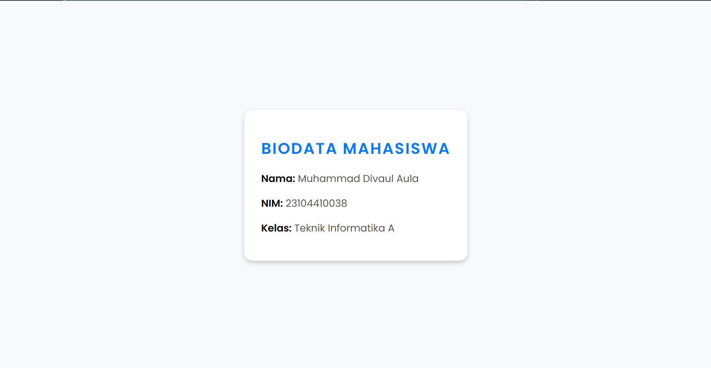

# Biodata Mahasiswa

Sebuah website sederhana untuk menampilkan data mahasiswa menggunakan framework Laravel.

## Demo




## Instalasi

Ikuti langkah-langkah di bawah ini untuk menjalankan proyek secara lokal:

```bash
# 1. Clone repositori
https://github.com/divaul/tugas-laravel.git

# 2. Masuk ke direktori proyek
cd tugas1

# 3. Install dependensi
composer install

# 4. Salin file .env dan sesuaikan konfigurasi
cp .env.example .env

# 5. Generate aplikasi key
php artisan key:generate

# 6. Buat database baru dan migrasi tabel
php artisan migrate

# 7. Jalankan server lokal
php artisan serve

#8. Jalankan pada
http://localhost:8000/mahasiswa

